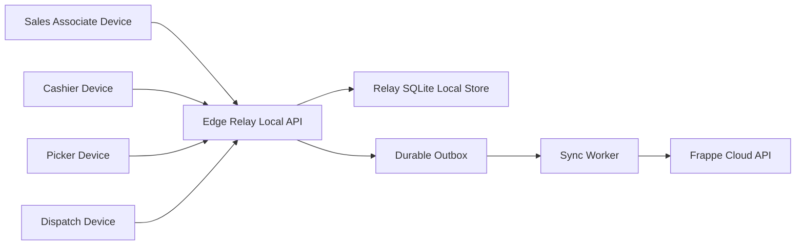

# POS Token and Edge Relay - Full Development Context (AI Handoff)

## 1. Purpose and Audience
This document is the authoritative handoff for all development completed so far around POS token flow and Edge Relay integration in this repository. It is intentionally detailed so another AI agent or engineer can resume work with full technical and operational context.

## 2. Repository / Branch Context
- Repository: webdev3pj/POS-Awesome-pj
- Base branch where investigation started: fix/app-install
- Main implementation sequence used:
  - cline-codex-v1
  - cline-codex-v2
  - kilo-codex-v1
- Current branch for this handoff document: kilo-codex-v1

## 3. Product Requirement Summary (as executed)
1. Implement token + edge relay workflow only for selected POS Profiles.
2. If feature is disabled on a profile, existing behavior must remain unchanged.
3. Build a practical local Edge Relay service for OptiPlex-style deployment.
4. Provide visible diagnostics in POS so operators can verify relay and cloud connectivity.
5. Keep secrets/runtime artifacts out of GitHub.

## 4. Commits and Capability Map

### 4.1 Commit 7450451
Message: feat: add POS-profile-gated relay workflow state for token/pick/dispatch
Key files:
- posawesome/hooks.py
- posawesome/posawesome/api/posapp.py
- posawesome/posawesome/doctype/pos_relay_workflow_state/*
- posawesome/public/js/posapp/components/pos/Invoice.vue
- posawesome/public/js/posapp/components/pos/Payments.vue
What it added:
- Relay workflow state model and logic (token, picking, dispatch)
- Profile-level gating using existing POS Profile checkbox custom_have_token
- Invoice lifecycle hooks to create/update workflow state
- Basic POS UI relay cues and submit-time queue message

### 4.2 Commit c53e4db
Message: feat(relay): add windows-friendly edge relay app with setup UI and realtime queue dashboard
Key files:
- relay/relay/app.py
- relay/relay/storage.py
- relay/relay/sync_worker.py
- relay/relay/windows_setup.py
- relay/relay/templates/*
- relay/start_relay.bat
- relay/README.md
- relay/SETUP_CHECKLIST_OPTIPLEX.md
What it added:
- Flask-based Edge Relay service
- Setup page, queue dashboard, health endpoint, metrics endpoint
- SQLite-backed event queue and sync worker
- Windows bootstrap automation helpers

### 4.3 Commit 0ec4e96
Message: feat(relay): one-click installer with auto python/deps and self-test
Key files:
- relay/start_relay.bat
- relay/relay/selftest.py
- docs updates in relay/README.md and relay/SETUP_CHECKLIST_OPTIPLEX.md
What it added:
- One-click startup path
- Dependency bootstrap behavior
- Self-test routine for quick validation

### 4.4 Commit b92129d
Message: chore(security): ignore relay local data and runtime artifacts
Key file:
- .gitignore
What it added:
- Ignore runtime/secret-prone relay artifacts (while preserving .gitkeep)

### 4.5 Commit 6f0b165
Message: feat(relay): add profile-gated edge relay connectivity status in POS
Key files:
- posawesome/posawesome/api/posapp.py
- posawesome/public/js/posapp/components/Navbar.vue
What it added:
- Backend connectivity endpoint to test relay reachability
- POS top-bar relay status chip with periodic polling

### 4.6 Commit 460e961
Message: feat(relay): per-profile edge relay URL and richer POS diagnostics
Key files:
- posawesome/fixtures/custom_field.json
- posawesome/fixtures/property_setter.json
- posawesome/posawesome/api/posapp.py
- posawesome/public/js/posapp/components/Navbar.vue
What it added:
- New POS Profile field custom_edge_relay_url
- Profile-specific relay URL support (with site fallback)
- Expanded relay diagnostics (source URL, status class, health URL, hints)

### 4.7 Commit 760c7c9
Message: feat(ui): add cloud internet connectivity status chip with diagnostics
Key file:
- posawesome/public/js/posapp/components/Navbar.vue
What it added:
- Additional top-bar cloud/internet connectivity status chip
- Browser online/offline + cloud reachability probe
- Latency, HTTP status, checked-at and message diagnostics

## 5. Architecture and Flow Details

### 5.1 POS Profile Gating
- Primary gating field: custom_have_token (existing field)
- New profile relay endpoint field: custom_edge_relay_url
- Principle: all relay/token logic is disabled when custom_have_token is off

### 5.2 Workflow State Model
- DocType: POS Relay Workflow State
- Core state dimensions:
  - token_status (Draft/Paid/Expired/Abandoned)
  - picking_status (Not Started/In Progress/Picked/Exception)
  - dispatch_status (Pending/Released/On Hold)
- State updates happen during invoice save/submit and via explicit relay methods

### 5.3 Edge Relay Service Responsibilities
- Receive local events from external systems/devices (token/pick/release)
- Receive POS invoice submissions for edge-first flow (`/relay/submit-invoice`)
- Queue events durably (SQLite)
- Sync to Frappe cloud via API tokens
- Provide operational visibility:
  - /health
  - /api/metrics
  - /api/queue

### 5.3.1 Edge-First Transaction Path (Current Plan-Aligned Implementation)
For relay-enabled POS Profiles with `custom_edge_relay_url` configured:
1. POS submits invoice payload to edge relay endpoint `/relay/submit-invoice`.
2. Edge relay stores event as `invoice_submit` in local queue.
3. Relay sync worker pushes queue event to cloud method `submit_invoice`.
4. If edge relay submit fails from POS browser, frontend falls back to direct cloud submit and shows warning.

### 5.4 POS UI Status Layer
In Navbar:
1) Relay status chip (profile-scoped):
   - Online / Not Configured / Timeout / Connection Error / HTTP Error / Offline
   - Opens diagnostics card with helpful details and hints
2) Cloud connectivity chip:
   - Internet Offline / Cloud Online / Cloud Unreachable
   - Uses browser online signal + request to frappe auth endpoint

## 6. Concrete Files to Inspect First (for any future work)
1. posawesome/posawesome/api/posapp.py
2. posawesome/public/js/posapp/components/Navbar.vue
3. posawesome/fixtures/custom_field.json
4. posawesome/fixtures/property_setter.json
5. relay/relay/app.py
6. relay/relay/sync_worker.py
7. relay/relay/storage.py
8. relay/start_relay.bat

## 7. Operational Checks Already Performed
- Relay health endpoint reachable locally (HTTP 200, ok true)
- Relay queue endpoints accepted and reflected queued events
- Token authentication to Frappe cloud validated using provided API key/secret
- During one test window, cloud lacked new methods (indicating deploy mismatch), confirming deployment/migration is required for end-to-end
- Python compile checks executed for modified backend file
- Fixture JSON parse checks succeeded

## 8. Known Constraints and Caveats
1. Cloud site must deploy this branch and run migrate/restart before new methods appear.
2. Local relay may run fine even if cloud API methods are not yet deployed.
3. Untracked local artifacts observed in workspace:
   - POS_Relay_End_to_End_Plan_with_Workflow_Exceptions_and_Edge_Cases.pdf
   - attendance.db
   These should not be committed unless explicitly needed.

## 9. Pending Work (Actionable)

### 9.1 Deployment Alignment (highest priority)
- Deploy branch kilo-codex-v1 to cloud app
- Run bench migrate and restart services
- Verify methods resolve:
  - get_relay_connectivity_status
  - get_relay_workflow_state
  - update_relay_picking_status
  - release_relay_dispatch

### 9.2 End-to-End UAT
For one enabled profile:
1. Set custom_have_token = 1
2. Set custom_edge_relay_url to target edge host
3. Open POS and verify both status chips
4. Create and submit invoice
5. Validate invoice first lands in edge relay queue (`invoice_submit`)
6. Validate relay sync submits invoice to cloud `submit_invoice`
7. Validate token/pick/dispatch transitions through relay and cloud
8. Confirm queue/error handling paths and fallback diagnostics

### 9.3 Hardening Backlog
- Add robust retry policy/backoff for sync worker
- Add richer failure telemetry and audit records
- Improve permission boundary and security review for relay endpoints
- Add localization pass for all diagnostic labels/messages
- Add formal operator runbook with screenshots

## 10. Rollback and Safety Notes
- Feature is profile-gated; turning off custom_have_token should disable workflow behavior for that profile.
- If relay URL invalid, diagnostics should indicate not configured or connection error without changing non-relay POS functionality.
- Keep API keys only in runtime config; do not commit secrets into tracked files.

## 11. Final State Snapshot
- Branch: kilo-codex-v1
- Latest known docs/layout commit: 99416d0
- Relay handoff assets now live in:
  - LLM_DEVELOPMENTS/POS_TOKEN_and_EDGE_RELAY/
- Includes:
  - profile-specific relay URL setting (from POS Profile)
  - detailed relay diagnostics
  - cloud internet/connectivity diagnostics
  - naming scheme documentation for future AI agents

## 12. Quick Resume Checklist for Next AI
1. Pull latest kilo-codex-v1.
2. Verify deployed cloud app has new methods.
3. Validate POS Profile field visibility and saved URL.
4. Validate relay + cloud chips in POS header.
5. Execute full invoice -> relay -> workflow state UAT.
6. Resolve any runtime errors with reproducible logs and commit minimal scoped fixes.

## 13. Operator Runbook: Testing on the Same OptiPlex (Dev Site + Relay)
This section answers the practical operator question: **Yes**, the Edge Relay address is set from ERPNext front-end on the POS Profile using field `custom_edge_relay_url`.

### 13.1 Where to set the relay URL (front-end)
1. Open ERPNext desk (dev site).
2. Go to **POS Profile** and open the profile you want to test.
3. Enable `Have Token!` (`custom_have_token`).
4. In `Edge Relay URL` (`custom_edge_relay_url`), enter the relay base URL.
5. Save POS Profile.

### 13.2 Important network rule (critical)
Relay status in POS is calculated by backend method `get_relay_connectivity_status`, which makes a server-side request from Frappe Cloud to `<Edge Relay URL>/health`.

That means:
- If you set `http://127.0.0.1:8787`, it points to loopback of the cloud server (not your OptiPlex), so relay status will show unreachable.
- For true cloud-to-edge validation, URL must be reachable from cloud (public IP, secure tunnel, VPN, or port-forwarded address with firewall rules).

### 13.3 Same-machine test sequence (recommended)
1. On OptiPlex, start relay with `relay/start_relay.bat`.
2. Open relay setup page and set:
   - Frappe URL: your dev cloud URL
   - API key and API secret
3. Confirm relay health locally:
   - open `http://127.0.0.1:8787/health`
4. Expose relay so cloud can reach it (choose one):
   - static/public IP + firewall/port route, or
   - secure tunnel endpoint.
5. Put that reachable URL in POS Profile `custom_edge_relay_url`.
6. Open POS session for that profile.
7. Verify top chips:
   - Relay chip: Online/Offline with diagnostics
   - Cloud chip: Cloud Online/Unreachable and internet state
8. Create and submit a test invoice.
9. Verify queue and state transitions in relay dashboard and POS workflow status.

### 13.4 Fast troubleshooting checklist
- Relay chip says **Not Configured**:
  - POS Profile `custom_edge_relay_url` empty and no site fallback configured.
- Relay chip says **Relay Identified / Not Reachable** or **Connection Error/Timeout**:
  - URL is configured and recognized, but not reachable from cloud path.
  - Check relay runtime, firewall, and cloud->relay routing.
- Cloud chip says **Internet Offline**:
  - local browser/device network down.
- Cloud chip says **Cloud Unreachable**:
  - browser can’t reach Frappe cloud endpoint or cloud returns error.

### 13.5 Specific case: OptiPlex LAN IP 192.168.50.168
If you set POS Profile `custom_edge_relay_url` to `http://192.168.50.168:8787`:
1. System **will identify** this relay configuration from POS Profile.
2. If Frappe Cloud has no network route to your LAN, relay status shows identified but unreachable.
3. To make it fully reachable from cloud, expose route via VPN/tunnel/public mapping/port forward (secured).
4. Once route exists, status should transition to online if `/health` responds successfully.

### 13.6 Expected success criteria
- POS Profile contains target `custom_edge_relay_url` (example `http://192.168.50.168:8787`).
- Relay diagnostics show:
  - Relay Identified = Yes
  - Relay Host = 192.168.50.168
  - Relay Host Type = private_lan
- If cloud route is present, relay chip shows **Online**.
- Cloud chip shows **Cloud Online**.
- For enabled profile with relay URL configured, submit flow is edge-first:
  1. Invoice is queued at edge relay (`invoice_submit` event)
  2. Relay sync submits it to cloud `submit_invoice`
  3. If relay call fails from browser, system falls back to direct cloud submit with warning.

## 14. Update Policy for This File
Whenever testing behavior, deployment status, or runbook steps change, update this markdown and regenerate the sibling PDF in the same folder before finalizing branch work.

## 15. Brainstorm and Gap Analysis for Offline Continuity Spec v2

This section maps the latest master spec to current implementation state and identifies exact gaps that must be closed in branch `kilo-codex-v2`.

### 15.1 High-level conclusion
Current implementation has a **good relay scaffold and profile gating**, but it is still **cloud-anchored** for core sale lifecycle and does **not yet satisfy full local-first offline continuity** across SA -> Cashier -> Picking -> Dispatch when cloud is down.

### 15.2 Gap matrix by requirement area

| Area | Requirement summary | Current state | Gap status |
|---|---|---|---|
| Master flag | `custom_have_token` ON enables workflow, OFF keeps current behavior | Implemented in POS/backend checks | Covered |
| Edge relay URL per profile | `custom_edge_relay_url` on POS Profile | Implemented | Covered |
| SA offline customer create/find | Must work while cloud down | No local customer store API in relay | Missing |
| SA offline item search | Must work while cloud down from relay cache | No relay item cache/search API | Missing |
| Token create/retrieve lifecycle | Local durable token store with expiry/void states | Relay has queue endpoint only, no token state DB/API | Missing |
| Cashier commit with idempotency | Mandatory idempotency key + first success wins | `submit-invoice` exists but no idempotency table/lock | Missing |
| Stable local sale reference | Return `local_sale_ref` immediately after commit | Not implemented | Missing |
| Double-pay prevention | Two cashiers must not pay same token | No atomic token consume lock | Missing |
| Multi-cashier sessions | Per-cashier per-device sessions, concurrent for same profile | Not implemented | Missing |
| Offline shift close | Session close local-first with sync later | Not implemented | Missing |
| Pick queue local-first | Queue from locally committed paid sales | Not implemented in relay local DB | Missing |
| Dispatch release gate | Paid + picked ready check offline | Not implemented in relay local DB/API | Missing |
| Durable outbox breadth | Queue all required event classes | Queue exists but event model incomplete | Partial |
| Cloud idempotent sync | Retries must not duplicate cloud records | No robust cloud idempotency mapping yet | Missing |
| Offline UX mode banner | Relay OK + cloud down allow full ops | Chips exist, strict mode banner/blocking incomplete | Partial |
| Acceptance tests 1..5 | Multi-device offline continuity + idempotency proofs | Not yet implemented as formal tests | Missing |

### 15.3 Architecture direction locked for v2
1. Relay becomes local system of record for pre-sync operations.
2. `commit_invoice` becomes atomic local transaction with token lock + idempotency key uniqueness.
3. Sync worker handles eventual cloud create/submit reconciliation from durable outbox.
4. POS UI enforces relay-required actions when profile is enabled and relay is unavailable.

## 16. v2 Target Local-First Architecture

### 16.1 Core local entities to add
- Token
- Token Line
- Cashier Session
- Local Sale
- Local Sale Line
- Idempotency Record
- Pick Event
- Dispatch Event
- Outbox Event with cloud correlation fields

### 16.2 Required relay APIs to add
- `POST /relay/token/create`
- `GET /relay/token/<token_id>`
- `POST /relay/token/<token_id>/void`
- `POST /relay/session/open`
- `POST /relay/session/close`
- `POST /relay/commit-invoice`
- `GET /relay/pick-queue`
- `POST /relay/pick/update`
- `POST /relay/dispatch/release`
- `GET /relay/items/search`
- `POST /relay/customer/upsert`

### 16.3 Commit idempotency rules
1. `idempotency_key` required.
2. Unique constraint on `idempotency_key`.
3. Unique token consume rule so only first commit for a token succeeds.
4. Replay with same key returns same `local_sale_ref` payload.

## 17. Phased Execution Plan for Branch kilo-codex-v2

### Phase 1 - Schema and atomic local sale commit
1. Extend relay DB schema with local-first entities and indexes.
2. Implement transaction-safe `commit_invoice` with token payment lock.
3. Generate and return durable `local_sale_ref`.

### Phase 2 - Token and session lifecycle
1. Implement token create/get/void and expiry enforcement.
2. Implement per-cashier session open/close with device metadata.
3. Allow concurrent sessions on same POS Profile.

### Phase 3 - Pick and dispatch offline workflows
1. Build local pick queue from paid local sales.
2. Implement pick status transitions and exception states.
3. Implement release gate checks and immutable release audit records.

### Phase 4 - Offline catalog and customer continuity
1. Implement local item cache and search endpoint.
2. Implement offline customer upsert and lookup path.
3. Add best-effort refresh jobs when cloud is available.

### Phase 5 - Outbox hardening and cloud reconciliation
1. Expand outbox event model to required classes.
2. Add retry and backoff strategy and poison event handling.
3. Add cloud idempotency correlation fields and replay-safe linking.

### Phase 6 - POS UI and profile-gated behavior enforcement
1. For enabled profiles, route token/commit/pick/dispatch strictly through relay APIs.
2. Show explicit banner states:
   - OFFLINE MODE Relay Active
   - RELAY DOWN Offline continuity unavailable
3. Block relay-dependent actions if relay is down for enabled profile.

### Phase 7 - Test and evidence pack
1. Implement automated tests for acceptance tests 1..5.
2. Execute LAN outage simulations and capture outputs.
3. Produce operator validation checklist and final proof logs.

## 18. Exact Next To-Do List from This Brainstorm
1. Add v2 execution checklist markdown under `plans/` with acceptance criteria traceability.
2. Switch to Code mode for implementation across Python and Vue files.
3. Implement relay schema and APIs first before POS UI wiring.
4. Implement sync reliability and idempotency reconciliation next.
5. Implement strict relay-required UI behavior for enabled profiles.
6. Run acceptance tests 1..5 and capture evidence.
7. Update this handoff markdown and regenerate PDF.
8. Push all changes to new branch `kilo-codex-v2`.

## 19. Open Clarifications to Confirm Before Coding
1. For enabled profiles, should direct cloud fallback be fully disabled when relay is unreachable.
2. Whether item rate in offline cache is hard snapshot only or must include branch price rules.
3. Whether dispatch partial release is enabled in v2 baseline or kept supervisor-gated only.

## 20. v2 Implementation Progress Snapshot (kilo-codex-v2)

### 20.1 Completed in this cycle
1. Created branch `kilo-codex-v2`.
2. Implemented relay local-first persistence model in `relay/relay/storage.py`:
   - token/session/local-sale entities
   - idempotency table
   - outbox table with retry metadata
   - pick/dispatch event tables
   - customer cache and item cache
3. Implemented new relay APIs in `relay/relay/app.py`:
   - `/relay/token/create`, `/relay/token/<token_id>`, `/relay/token/<token_id>/void`
   - `/relay/session/open`, `/relay/session/current`, `/relay/session/close`
   - `/relay/customer/upsert`, `/relay/customer/search`
   - `/relay/items/search`, `/relay/items/refresh`, `/relay/items/refresh-from-cloud`
   - `/relay/commit-invoice`
   - `/relay/pick-queue`, `/relay/pick/update`, `/relay/dispatch/release`
   - `/api/outbox`
4. Added outbox sync logic in `relay/relay/sync_worker.py` with retry/backoff and cloud posting path for `SALE_COMMITTED`.
5. Added offline cache helper module `relay/relay/offline_sync.py`.
6. Updated relay dashboard/docs/checklists for outbox visibility and v2 endpoints.
7. Updated POS UI behavior:
   - `Payments.vue`: relay-enabled profiles block submit when relay down; direct-cloud fallback disabled in relay path; commit via `/relay/commit-invoice`; local sale ref displayed.
   - `Navbar.vue`: explicit mode chips for
     - `RELAY DOWN (Offline continuity unavailable)`
     - `OFFLINE MODE (Relay Active)`
   - `Invoice.vue`: best-effort token create call to relay at draft update stage.
8. Added automated acceptance test suite:
   - `relay/tests/test_offline_workflow.py`
   - validates acceptance tests 1..5 at relay API level.

### 20.2 Validation results
Executed:
- `python -m compileall relay/relay`
- `python -m relay.selftest`
- `python -m unittest tests.test_offline_workflow -v`

Result summary:
- Compile OK
- Self-test OK
- 5/5 acceptance tests passed (relay integration level)

### 20.3 Known limitations remaining after this cycle
1. Cloud sync idempotency reconciliation is improved but still phase-1 level for non-sale events (pick/release/session/token are partially queued and partially cloud-mapped).
2. POS SA offline customer/item UX is backend-capable via relay endpoints but not yet fully wired into existing POS search/input widgets.
3. Current token identity in POS still derives from draft invoice suffix; QR payload remains token id only as required.
4. Full ERPNext closing artifact reconciliation from local session close is still pending for deeper POS shift parity.

### 20.4 Immediate next tasks
1. Wire `Customer.vue` and item selector components to relay cache endpoints during cloud outage windows.
2. Extend sync worker endpoint mapping and cloud-side idempotency correlation for `PICK_EVENT`, `RELEASE_EVENT`, `SESSION_*`, `TOKEN_CREATED`.
3. Add operator-facing pick/dispatch UI screens in POS (or dedicated relay UI) for role flows.
4. Replace UTC deprecation-sensitive calls with timezone-aware datetime helpers.
5. Finalize cloud deployment script and run outage recovery test against real cloud site.
