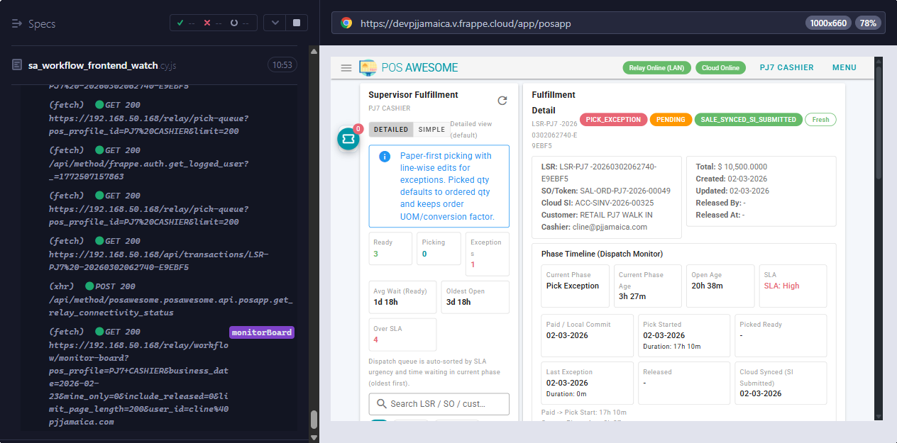

# Sales Associate Manual (Very Simple)

## What your job is

Your only main job is:
- Build the customer order.
- Save the order as a Sales Order token.
- Hand the customer to the cashier.

You do not take payment.

## When you do work

- Start of shift: log in, open POS session.
- During shift: create tokens fast and correctly.
- End of shift: make sure no customer is waiting without a token.

## Exact buttons you need to know

1. `Save/New`
- What it does: saves the cart and creates a Sales Order token.
- When to click: after customer confirms items and total.

2. `Save Quote` (if your manager enabled quotations)
- What it does: saves the cart as a quotation.
- When to click: customer is not ready to buy now.

3. `Select Quote` (if enabled)
- What it does: loads a saved quotation.
- When to click: customer returns with a quotation.

4. `Cancel`
- What it does: clears the current cart.
- When to click: wrong customer or wrong items loaded.

5. `PAY`
- What it does: opens payment page.
- When to click: do not click as Sales Associate.

6. `Held`
- What it does: opens held draft invoices.
- When to click: only if manager told you to resume a held draft.

7. `Return`
- What it does: opens return flow.
- When to click: normally cashier or manager handles returns.

8. `Print Draft`
- What it does: prints a draft invoice copy.
- When to click: only if store process asks for draft copy.

9. Order Monitor ticket icon (small round button)
- What it does: opens order monitor side panel.
- When to click: to confirm your token/order appears in queue.

10. `All (date)` and `Mine` (inside order monitor)
- What they do: filter queue rows.
- When to click: use `Mine` to see only your orders.

11. Refresh icon inside order monitor
- What it does: reloads monitor rows.
- When to click: after creating token and you need to confirm it showed up.

12. Item row icons: delete, minus, plus
- What they do: remove line, lower qty, increase qty.
- When to click: when customer changes order line.

## Step-by-step (daily)

1. Select customer.
2. Add item(s).
3. Check qty and total with customer.
4. Click `Save/New`.
5. In token popup, print token slip.
6. Tell customer: "Take this token to cashier."

## Do not do these

- Do not collect payment.
- Do not release goods.
- Do not override mismatch or exception.

## If something breaks

1. Try refresh once.
2. Keep order number/token number.
3. Tell supervisor and cashier immediately.

