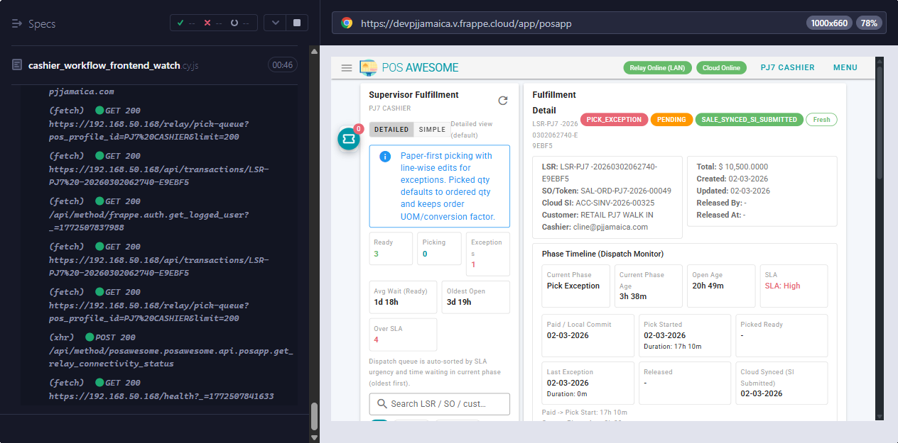
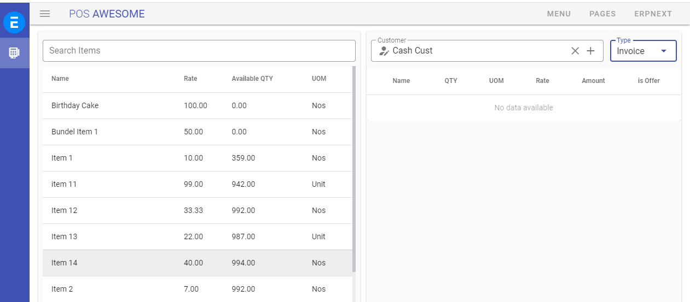

# Cashier Manual (Very Simple)

## What your job is

Your job is:
- Find the Sales Order token from customer.
- Take payment.
- Submit invoice.

## When you do work

- Start of shift: open cashier session and cash opening amounts.
- During shift: process payments and submit invoices.
- End of shift: complete pending payments and close with supervisor.

## Exact buttons you need to know

1. `Select S.O`
- What it does: opens Sales Order selection.
- When to click: first step when customer gives token.

2. `PAY`
- What it does: opens payment panel.
- When to click: after loading correct Sales Order/cart.

3. Payment mode buttons (example: `Cash`, `Card`, `Cheque`, `Bank`, or configured mode names)
- What they do: set the full amount to that payment mode row.
- When to click: choose how customer is paying.

4. `Request` (phone payment mode only, if configured)
- What it does: sends payment request to customer phone.
- When to click: only for phone payment process.

5. `Get Payments <Mode>` (M-Pesa style mode only, if configured)
- What it does: fetches mobile payments.
- When to click: only for that payment integration.

6. `Submit`
- What it does: submits invoice without auto-print.
- When to click: normal completion when payment is correct.

7. `Submit & Print`
- What it does: submits invoice and prints.
- When to click: if customer needs printed slip now.

8. `Cancel Payment`
- What it does: exits payment panel and returns to invoice/cart view.
- When to click: wrong amount entered or wrong order loaded.

9. `Cancel`
- What it does: cancels current cart.
- When to click: wrong order loaded and you want to restart.

10. `Save/New`
- What it does: saves and starts a new cart/token style flow.
- When to click: only for approved direct sale flow.

11. `Held`
- What it does: opens held drafts.
- When to click: only if manager asks to resume held draft.

12. `Return`
- What it does: opens return invoice flow.
- When to click: when processing approved customer return.

13. `Print Draft`
- What it does: prints draft invoice.
- When to click: only if store process asks.

14. Order Monitor ticket icon
- What it does: opens order monitor panel.
- When to click: check pending queue and handoff status.

15. `All (date)` / `Mine` / refresh in order monitor
- What they do: filter and refresh queue rows.
- When to click: use after submit to confirm flow moved forward.

## Step-by-step (daily token flow)

1. Ask customer for token slip.
2. Click `Select S.O`.
3. Search and load correct order.
4. Click `PAY`.
5. Click payment mode button.
6. Check `To Be Paid` is zero.
7. Click `Submit` or `Submit & Print`.
8. Confirm success message and invoice number.
9. Direct order to picker/dispatch process.

## Do not do these

- Do not bypass payment mismatch.
- Do not release goods.
- Do not override exception without supervisor.

## If something breaks

1. Do not click submit many times.
2. Copy order number and timestamp.
3. Call supervisor immediately.

