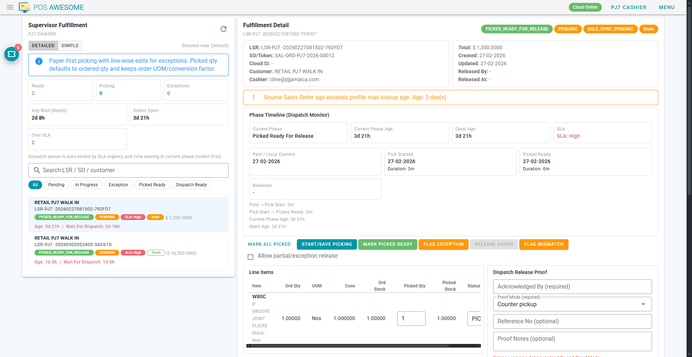

# Supervisor Manual (Stupid Simple)

## Role sanity (must be true)
- Your only operational role is `cline-Supervisor`.
- If you see "multiple operational roles", stop and correct role assignment first.

## Your job
- Resolve exceptions.
- Approve controlled partial releases.
- Keep audit notes complete.

## When to do what
1. Start of shift:
- Check exception rows first.
- Check SLA-high rows second.

2. During shift:
- Review line-level pick and dispatch proof/mismatch details.
- Decide one path: return to picker, mismatch route, or controlled release.

3. End of shift:
- No unresolved exception without clear next action note.

## Every visible button/field on supervisor screen
1. Refresh icon: reload queue/detail.
2. `DETAILED` / `SIMPLE`: view mode.
3. Search + filter chips (`All`, `Pending`, `In Progress`, `Exception`, `Picked Ready`, `Dispatch Ready`).
4. Picker controls:
- `MARK ALL PICKED`
- `START/SAVE PICKING`
- `MARK PICKED READY`
- `FLAG EXCEPTION`
5. Dispatch controls:
- `RELEASE GOODS`
- `FLAG MISMATCH`
- `Allow partial/exception release`
6. Dispatch proof fields:
- `Acknowledged By`
- `Proof Mode`
- `Reference No`
- `Proof Notes`
7. Mismatch fields:
- `Reason Code`
- `Reason Details`
- `Requires cashier adjustment`
8. Notes:
- `Picker notes`
- `Dispatch notes`
9. Event panels:
- `Pick History`
- `Dispatch + Sync`

## Edge cases you must follow
1. If queue has no `Pending/In Progress`, work from `Exception` or `Picked Ready` rows and normalize safely.
2. Partial/exception release still requires proof fields.
3. If mismatch action does not persist, escalate and log LSR + timestamp.

## Non-negotiable rules
- No release without proof.
- No override without note and reason.
