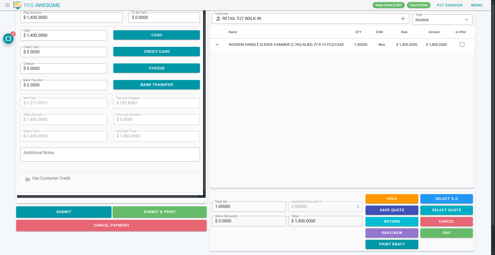
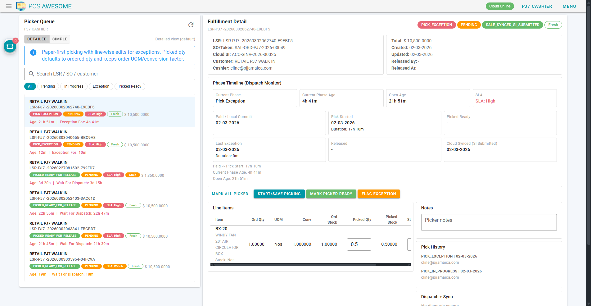
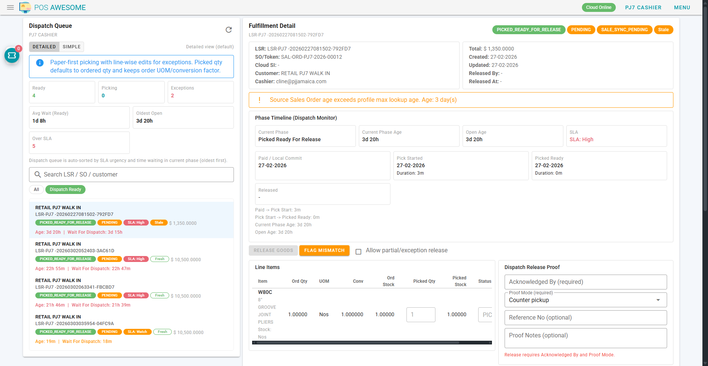

# POS Process Overview (All Roles)

## One-line process
Sales Associate creates token -> Cashier takes payment -> Picker picks -> Dispatch releases -> Supervisor handles exceptions/overrides.

## Role ownership
1. Sales Associate:
- Cart + token creation.
- No cash shift amounts, no payment, no release.

2. Cashier:
- Opening cash shift amounts.
- Select S.O + payment submit.

3. Picker:
- Line-wise picking updates.
- Pick ready / exception.

4. Dispatch:
- Release proof capture.
- Release goods or mismatch return.

5. Supervisor:
- Exception governance.
- Controlled partial/exception releases.

## Handoff checkpoints
1. SA -> Cashier:
- Token/SO must exist and customer sent to cashier.

2. Cashier -> Picker:
- Payment submitted.
- Row appears in fulfillment queue.

3. Picker -> Dispatch:
- Pick complete and status ready, or exception documented.

4. Dispatch -> Customer:
- Proof captured and status released.

5. Any role -> Supervisor:
- Exception, mismatch, or blocked action.

## Required operational rules
1. SA never enters opening shift money.
2. Cashier owns opening/closing cash accountability.
3. Dispatch release requires proof (`Acknowledged By` + `Proof Mode`).
4. Mismatch requires reason and correct routing.

## Quick visual references

## Escalation template (all staff)
1. Role.
2. Order reference (`SO` or `LSR`).
3. Exact error message.
4. Timestamp.
