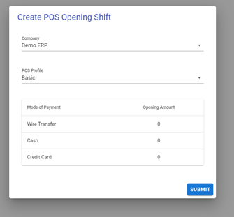
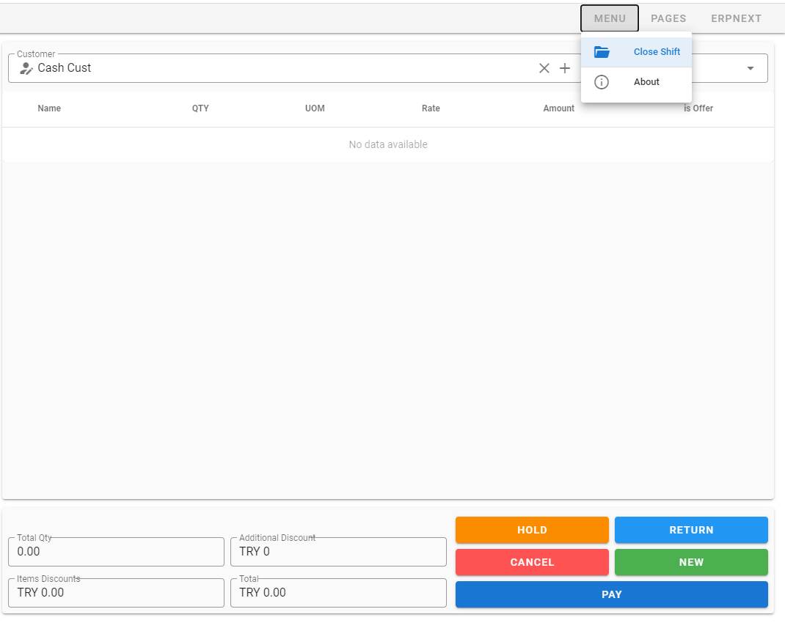

# POS Process Overview (All Roles)

## Why this page exists

This page tells everyone:
- who does what,
- in what order,
- and where to hand off.

## Role map (simple)

1. Sales Associate
- Builds order and creates token.
- Hands customer to cashier.

2. Cashier
- Finds token order.
- Takes payment and submits invoice.
- Hands order to picker queue.

3. Picker
- Picks items.
- Marks ready or flags exception.
- Hands ready row to dispatch.

4. Dispatch
- Captures release proof.
- Releases goods or flags mismatch.
- Hands mismatch to supervisor.

5. Supervisor
- Resolves exception and mismatch paths.
- Approves controlled overrides with notes.

## One full order flow

1. Sales Associate: create token (`Save/New`) and print token.
2. Cashier: `Select S.O` -> `PAY` -> `Submit`.
3. Picker: update picked qty -> `Mark Picked Ready`.
4. Dispatch: fill proof -> `Release Goods`.
5. Supervisor: only steps in when there is exception/mismatch.

## Handoff checklist by role

1. Sales Associate to Cashier
- Provide clear token/order ID.
- Confirm customer knows to pay cashier.

2. Cashier to Picker
- Payment submitted successfully.
- Order appears in fulfillment queue.

3. Picker to Dispatch
- Lines picked and status ready.
- Notes added if partial/exception history exists.

4. Dispatch to Customer
- Proof captured.
- Status released.

5. Any role to Supervisor
- Any exception, mismatch, or blocked action.

## Escalation rule (all staff)

If blocked, report these 4 items:
1. Your role.
2. Order reference (`SO` or `LSR`).
3. Exact error text.
4. Time of issue.

## Daily timing guide

1. Opening: confirm role, open session, check status chips.
2. Live operations: follow role-only buttons.
3. Closing: clear open tasks, hand over unresolved exceptions.

